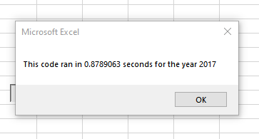
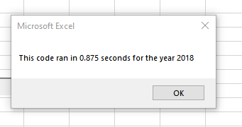

# Stock-Analysis

Repository address: https://github.com/cpstell/stock-analysis

## Overview of Project

To analyze twelve stocks Steve's parents were thinking about investing in and to 
provide the information needed to make the correct decision. The code was 
refactored in an attempt to make it run quicker and more efficient.

## Results

After the code was refactored it ran faster due to a simpler command structure
which requires less proccesoing power to operate. The results can be seen below
with the reduction in times. Overall the difference is a few milliseconds between 
the original code and the refactored code which is a huge benefit.

#### Here's how my refactored code looks:

 '1a) Create a ticker Index
    
      
        Dim tickerIndex
        
        tickerIndex = 0

    '1b) Create three output arrays
    
   
        Dim tickerVolumes(11) As Long
        Dim tickerStartingPrices(11) As Single
        Dim tickerEndingPrices(11) As Single
    
    
    ''2a) Create a for loop to initialize the tickerVolumes to zero.
    
        For i = 0 To 11
        
        tickerVolumes(i) = 0
        
    ''2b) Loop over all the rows in the spreadsheet.
    
    For i = 2 To RowCount
    
        '3a) Increase volume for current ticker
        
        ' This code was included in the Module
        
        tickerVolumes(tickerIndex) = tickerVolumes(tickerIndex) + Cells(i, 8).Value
        
        
        '3b) Check if the current row is the first row with the selected tickerIndex.
        'If  Then
        
                   
        If Cells(i - 1, 2).Value <> tickers(tickerIndex) Then
        
        tickerStartingPrices(tickerIndex) = Cells(i, 7).Value
            
            
        'End If
        
        '3c) check if the current row is the last row with the selected ticker
         'If the next row’s ticker doesn’t match, increase the tickerIndex.
        'If  Then
        
        If Cells(i + 1, 2).Value <> tickers(tickerIndex) Then
        tickerEndingPrices(tickerIndex) = Cells(i, 7).Value
            

            '3d Increase the tickerIndex.
            
            tickerIndex = tickerIndex + 1
            
            
        'End If
    
    Next i
    
    '4) Loop through your arrays to output the Ticker, Total Daily Volume, and Return.
    
       
    For i = 0 To 11
        
        Worksheets("All Stocks Analysis").Activate
        
        tickerIndex = i
        Cells(i + 4, 1).Value = tickers(tickerIndex)
        Cells(i + 4, 2).Value = tickerVolumes(tickerIndex)
        Cells(i + 4, 3).Value = tickerEndingPrices(tickerIndex) / tickerStartingPrices(tickerIndex) - 1
        
    Next i
    
   
   ## Summary
   
   The advantages of refactoring are it offers a simpler, more concise code, with quicker processing times, and the use of less processing power. 
   The disadvantages of refactoring are you take code that is working, and in the process of trying to make it better, you may introduce bugs that
   have to be fixed and will probably spend more time researching ways to improve an already working product.
   
    
    
    
    
